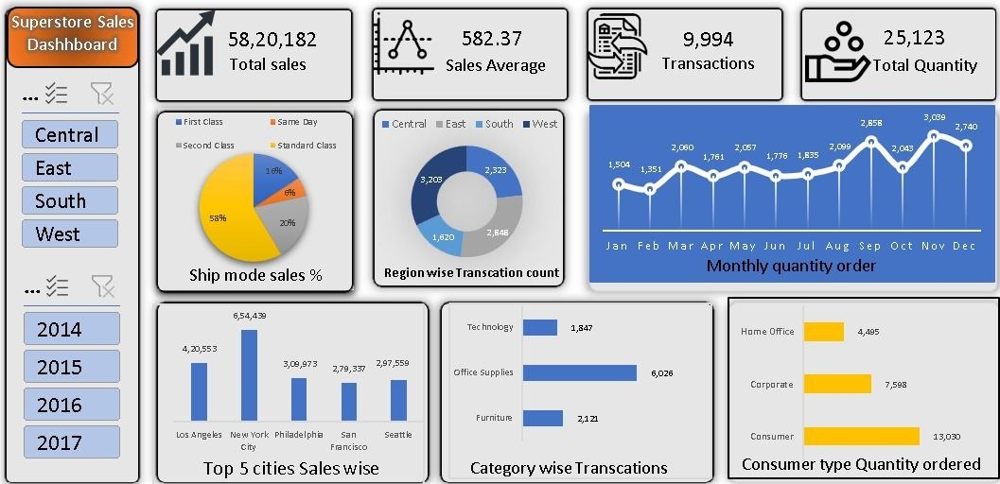

# Superstore Sales Analysis Dashboard (Excel)

A simple Excel dashboard created using the Superstore Sales dataset to analyze sales performance and business trends.

## Project Overview

This project is an interactive sales dashboard created in Microsoft Excel using the Superstore Sales dataset. The dashboard provides a quick overview of sales performance, customer segments, shipping modes, regions, and product categories using charts, KPI cards, and slicers.

## Project Objective

The main objective of this project is to analyze sales data and present important business information in a simple and interactive dashboard. It helps users understand sales trends and compare performance across different regions and customer segments.

**Dataset Source:**  
https://www.kaggle.com/datasets/yesshivam007/superstore-dataset

## KPIs
- Total Sales
- Average Sales
- Total Transactions
- Total Quantity Ordered
- Ship Mode-wise Sales
- Region-wise Transactions
- Monthly Quantity Ordered
- Top 5 Cities by Sales
- Category-wise Transactions
- Customer Segment-wise Quantity Ordered

## Process

- Imported the dataset into Microsoft Excel.
- Checked the data before analysis.
- Created Pivot Tables for different business metrics.
- Built Pivot Charts for visualization.
- Added KPI cards.
- Used slicers for Region and Year filtering.
- Designed the final interactive dashboard.

## Dashboard

## Key Insights

- Total Sales: **5,820,182**
- Average Sales: **582.37**
- Total Transactions: **9,994**
- Total Quantity Ordered: **25,123**
- Standard Class is the most used shipping mode.
- West region has the highest number of transactions.
- November recorded the highest quantity ordered.
- New York generated the highest sales.
- Office Supplies has the highest number of category-wise transactions.
- Consumer segment ordered the highest quantity.

## Conclusion

This project shows how Microsoft Excel can be used to analyze sales data and build an interactive dashboard. It helped me improve my Excel, data analysis, dashboard design, and business reporting skills.
